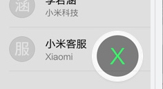
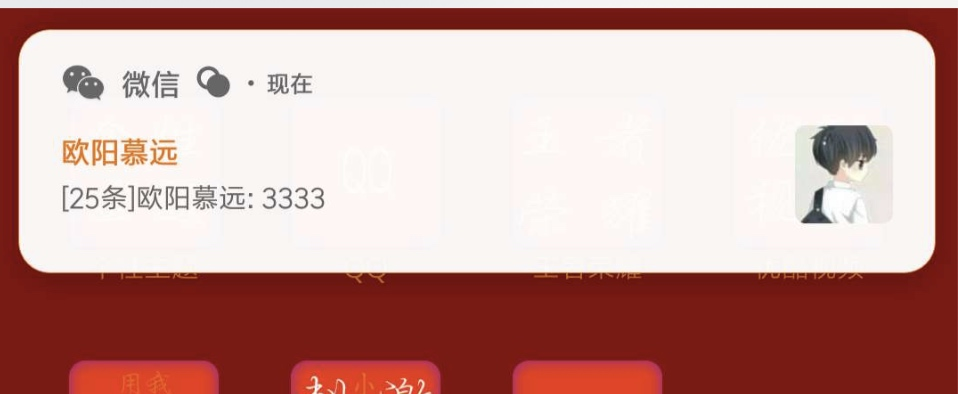
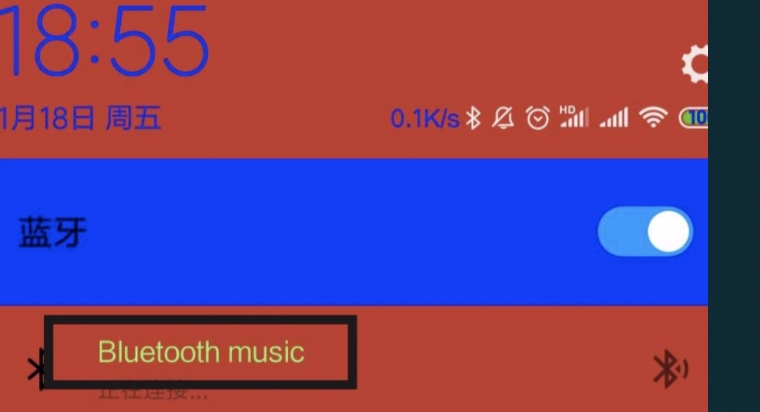
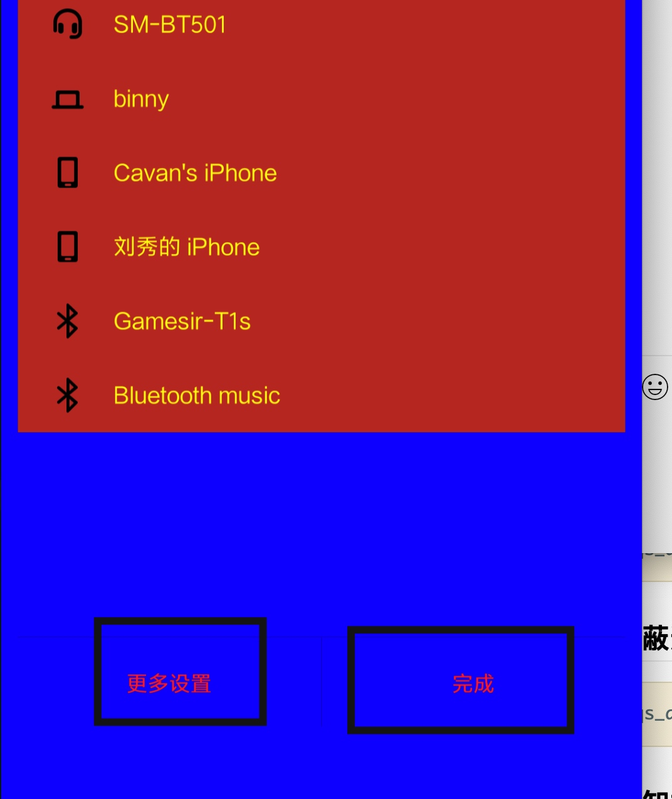
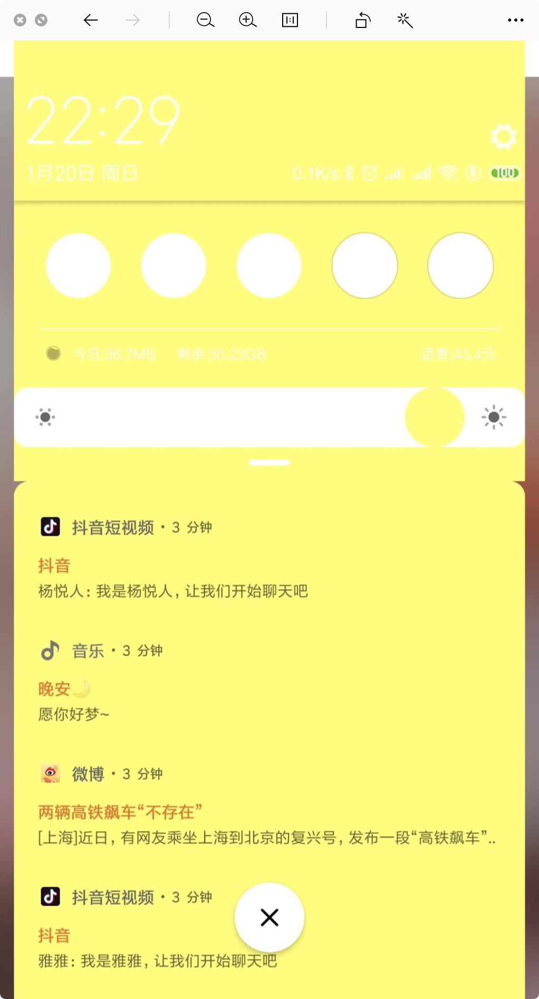
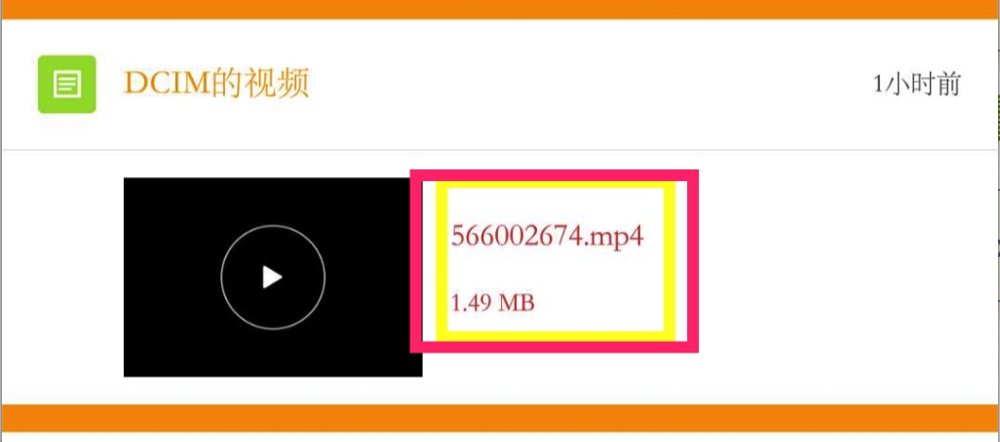
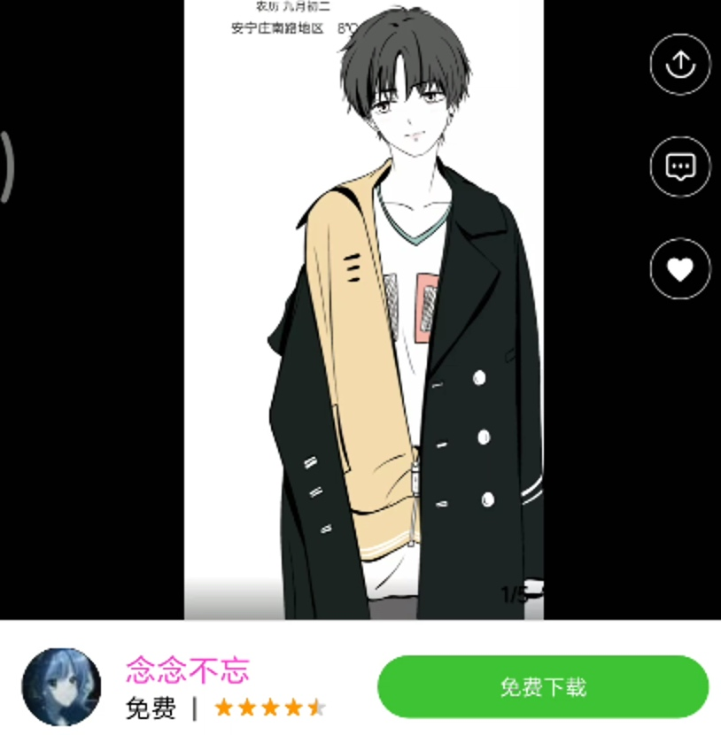

# MIUIThemes
小米主题制作辅助脚本

各个模块的颜色总结

```
此文档意在提高设计师的工作效率，有问题的地方和不足的地方，请联系 QQ：596928539修正，谢谢！
```
# 全局高亮色
```
highlight_normal_light
```
# 一 短信模块
## 1.1 MIUI 全局属性
### 1.1.1 该模块下的`white`属性，图中的绿色部分
短信界面短信列表


图二 搜索框搜索结果


### 1.1.2 Title文字、以及短信对话页面的联系人
#### 1.1.2.1 Title文字
```
action_bar_title_text_color_light
```
如果设置成黑色，小米6则无效，可能跟原生全局有关。


#### 1.1.2.2 短信对话页面的联系人


#### 1.1.2.3 Title中次要文字

```
action_bar_subtitle_text_light
```


### 1.1.3 搜索框
#### 1.1.3.1 搜索框提示字体

```
edit_text_search_hint_color_light
```


#### 1.1.3.2 搜索框输入字体颜色 

```
edit_text_search_color_light
```


#### 1.1.3.3 搜索框背景色 

```
edit_text_search_bg_color_light
```
### 1.1.4 短信界面item属性
#### 1.1.4.1 收件人名字的颜色属性
同时也是详情页的名字颜色属性
```
list_text_color_normal_light
```


#### 1.1.4.2 “今早,昨天，更早”文字颜色(联系人“全部通话”文字颜色)

```
list_view_item_group_header_text_light
```

#### 1.1.4.3 列表常态次要字体（以及时钟—计时的列表文字常态 ）

```
list_secondary_text_color_normal_light
```

#### 1.1.5 验证码页底部按钮
文件管理器 远程管理 “wlan状态”文字颜色
新建短信 最近联系人字体颜色
```
bright_foreground_light
```


## 1.2 模块颜色属性及图片资源

### 1.2.1 短信界面点击搜索短信，匹配结果的背景


### 1.2.2 点击短信界面，写短信按钮，进入下一界面的`收件人`搜索结果背景


### 1.2.3 短信列表界面

#### 1.2.3.1 背景色
原生全局里面 修改`transparent` 即可
#### 1.2.3.2 分割线的颜色
```
section_divider_stroke_color
```
#### 1.2.3.3 日期(会话)背景色
```
conversation_date_color
```
#### 1.2.3.4 短信列表未读短信联系人标题颜色（V10无效）

```
text_color_highlight
```
#### 1.2.3.5 item的滑动
##### 1.2.3.5.1 item 被左滑或者右滑时，新出现的那一块的文字颜色
```
drag_text_color
```
##### 1.2.3.5.2 向右滑动，左侧出现的那一块背景色
```
drag_background_color
```
##### 1.2.3.5.3 向左滑动，右侧出现的那一块背景色
```
drag_background_color_right
```
##### 1.2.3.5.4 向左滑动，右侧那一块被点一下的颜色（一闪而过的颜色）
```
drag_background_color_right_p
```

### 1.2.4 彩信
#### 1.2.4.1 页码文字颜色

```
flatshow_pageno_text_color
```
#### 1.2.4.2 彩信页码文字阴影的颜色
```
flatshow_pageno_text_shadow_color
```
### 1.2.5 快速回复
#### 1.2.5.1 快速回复短信弹窗回复按钮字体颜色常态 

```
float_notification_button_color_n
```
#### 1.2.5.2 快速回复短信弹窗回复按钮字体颜色按下态

```
float_notification_button_color_p
```
 
### 1.2.6 短信详情界面
#### 1.2.6.1 收到短信的气泡中的相关属性
##### 1.2.6.1.1 字体颜色
```
text_color_message_in
```
##### 1.2.6.1.2 字体颜色（按下）
```
text_color_message_in_pressed
```
##### 1.2.6.1.3 连接和数字的颜色

```
text_color_message_in_highlight
```

##### 1.2.6.1.4 链接和数字颜色（按下）
```
text_color_message_in_highlight_pressed
```

#### 1.2.6.2 发出短信的的气泡中的相关属性
##### 1.2.6.2.1 字体颜色

```
text_color_message_out
```

##### 1.2.6.2.2 发出短信气泡中------字体颜色（按下）

```
text_color_message_out_pressed
```
##### 1.2.6.2.3 发出短信气泡中------链接和数字颜色

```
text_color_message_out_highlight
```
##### 1.2.6.2.4 发出短信气泡中------链接和数字颜色（按下）

```
text_color_message_out_highlight_pressed
```
#### 1.2.6.3 短信中发送时间及发送状态文字颜色

```
list_secondary_text_color_normal_light
```
#### 1.2.6.4 短信对话界面的时间日期颜色以及短信/彩信分割文字颜色按下态  （没搞明白）

```
list_secondary_text_color_pressed_light
```
### 1.2.7 网络短信相关
#### 1.2.7.1 文字常态

```
text_color_message_out_mx
```
#### 1.2.7.2 文字按下态

```
text_color_message_out_mx_pressed
```

#### 1.2.7.3 收件人常态

```
text_color_mi_recipient
```
#### 1.2.7.4 收件人按下态

```
text_color_mi_recipient_pressed
```
### 1.2.8 短信名片
**已短信的形式发出去的名片的属性**
#### 1.2.8.1 短信名片标题颜色 
```
text_color_card_name
```
#### 1.2.8.2 短信名片背景

```
bubble_color_default_n
```

#### 1.2.8.3 短信名片背景分隔线 
```
card_divider_color
```
### 1.2.9 新建短信
#### 1.2.9.1 新建短信按钮颜色
```
fab_bg_color
```
#### 1.2.9.2 关于收件人
##### 1.2.9.2.1 新建短信“收件人”提示颜色
```
recipient secondary text color
```
##### 1.2.9.2.2 最近收件人名字常态颜色1（有效）
```
text_color_recent_contact
```

##### 1.2.9.2.3 最近收件人名字常态颜色2（无效,估计在全局里）
```
list_text_color_normal_light
```
##### 1.2.9.2.4 最近收件人按下时“收件人”名字的颜色

```
list_text_color_pressed_light
```
##### 1.2.9.2.5 最近联系人文字颜色已选态 

```
list_text_color_disable_light
```
##### 1.2.9.2.6 最近收件人被选作为`收件人`时，“收件人”名字在收件人框中的颜色。
此时正在`从最近的收件人中选择收件人的过程中`

```
text_color_recipient_item
```
##### 1.2.9.2.7手动输入收件人文字颜色（双卡文字颜色）

```
text_color_recipient
```
### 1.2.10 短信的编写
#### 1.2.10.1 输入框的填充色（背景色）
```
button_send_slot_bg_n
```
#### 1.2.10.2 输入框“短信”提示字体颜色 

```
hint_edit_text_color_light
```
### 1.2.11 短信的双卡（发送）
#### 1.2.11.1 双卡中，sim卡选中状态的背景颜色

```
button_send_slot_bg_p
```
#### 1.2.11.2 双卡文字的常态

```
sim_indicator_color_normal
```

#### 1.2.11.3 双卡文字的已选态
```
sim_indicator_color_selected
```
### 1.2.12 短信附件
#### 1.2.12.1 短信附件标题颜色以及文字表情颜色

```
text_color_attachment_type
```

#### 1.2.12.2 短信附件标题文字 
```
text_color_attachment_type_name
```
## 1.3 原生全局
### 1.3.1 white属性

```
影响对话框背景色
```
### 1.3.2 短信标题栏背景色
由`transparent`属性控制


# 二 联系人与通话 
## 2.1 MIUI全局属性
### 2.1.1 全部通话
### 2.1.1.1 字体颜色
```
list_view_item_group_header_text_light
```
### 2.1.1.2 背景颜色（模块属性）
* 也是 新增联系人，头像栏背景色
 ```
<color name="list_item_bg_normal">#ffff0000</color>
```

###2.1.2 该模块下的`white`属性
#### 2.1.2.1 对`item`的影响

* `通话和联系人`的列表
* `联系人右侧索引`的列表
* `编辑联系人`页`编辑联系人`这几个字所占的那一行
* `搜索框搜索记录`的列表
* `编辑联系人的群组名称出现的选择群主群组页`的`选择群主群`这几个字所占的那一行
* `编辑联系人的群组名称出现的选择群主群组页`的列表
   
比如蓝色部分

   

       
#### 2.1.2.2 点击出现的`对话框`的背景色也有该属性控制
* `长按联系人item出现的弹窗中`的列表
* `点击添加更多项`出现的列表
* `编辑联系人页面的标签，点击时出现`的选择列表

### 2.1.2 搜索框
#### 2.1.2.1 搜索框背景色
编辑里没有的话，直接复制下面代码到模块的文件中
```
<color name="edit_text_search_bg_color_light" package="miui">#fff05000</color>
```

#### 2.1.2.2 搜索框提示字体

```
edit_text_search_hint_color_light
```


#### 2.1.2.3搜索框输入字体颜色

```
edit_text_search_color_light
```

#### 2.1.2.4 搜索结果列表（MIUI）

##### 2.1.2.4.2 搜索结果

```
```

###### 2.1.2.4.2.2 未匹配字符的颜色

```
参考 2.1.4.2.1
```

###### 2.1.2.4.2.3 列表背景色

```
white
```
### 2.1.3 索引(模块属性中也有相关其他的配置)
####2.1.3.1 联系人页面，右侧字母未选择的颜色
```
alphabet_indexer_text_color
```
#### 2.1.3.2 右侧索引已选中字母颜色

```
indexer_text_highlight
```
#### 2.1.3.3 联系人页面，索引悬浮快的颜色
```
<color name="alphabet_indexer_overlay_text_color" package="miui">#ffff9933</color>
```

#### 2.1.3.4 索引被选中的高亮色
```
<color name="alphabet_indexer_highlight_text_color" package="miui">#ff99ff99</color>
```

### 2.1.4 主界面列表
#### 2.1.4.1 主要字体颜色
##### 2.1.4.1.1 常态

```
<color name="list_text_color_normal_light" package="miui">#ff99ff66</color>
```
##### 2.1.4.1.2 按下

```
<color name="list_text_color_pressed_light" package="miui">#fff05000</color>
```
#### 2.1.4.2 次要字体颜色
##### 2.1.4.2.1 常态
```
list_secondary_text_color_normal_light
```

##### 2.1.4.2.2 按下
```
<color name="list_secondary_text_color_pressed_light" package="miui">#fff05000</color>
```
#### 2.1.4.3 item 被按下或者点击时的背景色
```
list_item_bg_color_pressed_light
```
#### 2.1.4.4 列表分割线

```
<color name="divider_line_light" package="miui">#ffff0000</color>
```
### 2.1.5 编辑模式
#### 2.1.5.1 编辑模式 action bar上的标题文字颜色

```
<color name="action_mode_title_text_color_light" package="miui">#ff99ff33</color>
```
#### 2.1.5.2 输入框输入字体颜色

```
edit_text_color_light
```


### 2.1.6 分享 通话记录 收藏 (详情页的)
```
<color name="dim_foreground_light" package="miui">#ff99ff33</color>
```
### 2.1.7 弹窗
#### 2.1.7.1 列表字体，常态

```
dialog_list_text_color_normal_light
```
#### 2.1.7.2 列表字体，按下

```
dialog_list_text_color_pressed_light
```
#### 2.1.7.3 弹窗title字体 
```
dialog_title_text_color
```
#### 2.1.7.4 弹窗底部"取消"按钮字体颜色

```
<color name="button_text_color_dialog_light" package="miui">#ff66ff66</color>
```
### 2.1.8 联系人头像内文字颜色

```
<color name="word_photo_color" package="miui">#ffff0066</color>
```


###2.1.9 white
主要是通话和联系人一级界面的背景色
* 搜索记录的背景色
* 列表item的背景色
* ationbar背景色
### 2.1.10 联系人页添加联系人按钮的背景色

```
参考 2.3.2.0
```
### 2.1.11 添加联系人页
#### 2.1.11.1 头部背景色

```
参考  2.1.1.2 
```
####2.1.11.2 编辑框中提示文字颜色

```

```
## 2.2 原生全局属性
### 2.2.1 transprent 属性
transprent本身不设置，将会使用本意值`#00000000`
#### 2.2.1.1  通话和联系人的tab所在位置


#### 2.2.1.2 对通话界面的影响
#####2.2.1.2.1数字键盘的位置，头像icon的背景，


#### 2.2.1.2.2 数字键盘收起的按钮


#### 2.2.1.3 对联系人界面的影响
##### 2.2.1.3.1 直接看图吧

##### 2.2.1.3.2 对联系人新建页的影响--头像


##### 2.2.1.3.2 对联系人详情页的影响--编辑按钮


## 2.3 模块属性
###2.3.0 两个tab的共同属性
####2.3.0.1 搜索结果的高亮色

```
hight_light_text
```
#### 2.3.0.2 tab 上未选中的文字颜色
* 联系人未选中
* 通话未选中

```
tab_text_color_unfocused
```
#### 2.3.0.3 联系人 选中时颜色

```
contacts_accent_color
```
### 2.3.1 通话界面，即所在`tab`页
#### 2.3.1.1 `通话` 二字
小豆豆背景色的更好会影响"通话"二字的颜色
##### 2.3.1.1.1 未选择时，字体颜色
```
action_bar_tab_text_color_normal_light
```
##### 2.3.1.1.2 选中时，字体颜色
也是拨号按钮的背景色，即小豆豆，可在图片资源中，
`dialer_btn_call_bg.png`单独修改拨号按钮背景色
```
dialer_accent_color
```
#### 2.3.1.2 双卡拨号文字

```
dialer_buttons_text_color_normal
```
#### 2.3.1.3 拨号界面 “全部通话”栏列背景 

```
list_item_bg_normal
```
#### 2.3.1.4 拨号时
##### 2.3.1.4.1 tab栏“通话”字体 
也是详情页分享弹窗的字体颜色（包括其标题）
```
dialer_title_text_color
```


##### 2.3.1.4.2 拨号输入的字体颜色

```
dialer_digits_text_color
```


##### 2.3.1.4.3 拨号时顶部title背景色

```
dialer_title_bg.9.png
```

####2.3.1.5 拨号键盘
#####2.3.1.5.1 拨号左下角的菜单触发时的弹窗
######2.3.1.5.1.1 正文字体颜色

```
dialog_message_text_color_light
```
######2.3.1.5.1.2 标题文字颜色

```
dialog_title_text_color
```
######2.3.1.5.1.3 小背景色

```
<color name="dialer_menu_item_bg_color">#ffffff33</color>
```
黑色部分


###### 2.3.1.5.2.4 大背景色


```
dialog_bg_light.9.png
```


同时 也是 新建联系人的  添加更多的 点击弹窗
######2.3.1.5.1.3 取消 按钮的字体颜色


##### 2.3.1.5.2 右侧按钮

 
####2.3.1.6未接来电的主要文字颜色

```
missed_call_text
```
####2.3.1.5 拨号面板背景色

```
<color name="dialpad_divider_color">#ffccff33</color>
```
### 2.3.2 联系人列表界面
#### 2.3.2.0 联系人选中文字颜色（小豆豆背景颜色）
注意：小豆豆背景色值更改会影响「联系人」文字颜色 
可在图片资源action_button_main_new_light.png单独修改小豆豆背景色
```
contacts_accent_color
```

#### 2.3.2.1 小标题文字颜色
* 也是  点击搜索框时，"搜索记录"四个字的颜色,所在位置的文本颜色

```
header_text_label_color
```


#### 2.3.2.2 分隔线

```
list_divider_stroke
```


#### 2.3.2.3 与详情页切换时过渡色 

```
contact_photo_view_color0
```
### 2.3.3 添加联系人与编辑联系人
#### 2.3.3.1 `群组名称` 四个字（同时也是编辑、详情群组）

```
contact_editor_group_name_color
```


#### 2.3.3.2 标签字体
#####2.3.3.2.1常态

```
editor_label_text_color_n
```


#####2.3.3.2.2 按下态

```
editor_label_text_color_p
```
#### 2.3.3.3. 删除联系人 字体颜色

```
editor_button_confirm_color
```
#### 2.3.3.4 编辑联系人的`添加更多项` 文字颜色

```
editor_button_default_color
```

#### 2.3.3.5 输入框提示字

```
editor_hint_text_color_n
```

#### 2.3.3.6 头部背景色

```
list_item_bg_normal
```
### 2.3.4 联系人详情页
#### 2.3.4.1 列表 底层背景色（切换时可见） 

```
detail_activity_window_bg_light
```
#### 2.3.4.2  主色调（8个颜色随机显示）
* 控制着编辑按钮的背景色
* 收藏后的心形icon的颜色

```
vector_bg_major_color0

……

vector_bg_major_color8
```
#### 2.3.4.3 联系人名称文字

```
contact_detail_title_color
```

#### 2.3.4.4 标题次要字 

```
contact_detail_subtitle_color
```


#### 2.3.4.5 列表主要字体颜色以及通话记录列表主要字体颜色

```
contact_detail_list_item_primary_text_color
```


#### 2.3.4.6 列表副标题文字

```
contact_detail_list_item_secondary_text_color
```


#### 2.3.4.7 上滑之后的tab栏颜色 (无效)

```
contact_detail_photo_default_color
```
#### 2.3.4.8 收起时，顶部actionbarDe颜色

```
contact_detail_photo_default_color
```
### 2.3.5 索引(其他属性参考MIUI)
#### 2.3.5.1 索引顶部和横条当前索引首字母的颜色

```
header_text_lable_color
```

#### 2.3.5.2 右侧已选文字颜色

```
index_text_hightlight
```
### 2.3.6 搜索
#### 2.3.6.1 "搜索记录"四个字的颜色

```
参考 2.3.2.1
```
#### 2.3.6.2 匹配字符的颜色，高亮色

```
high_hight_text
``` 
### 2.3.7 通话记录详情，长按，底部的删除按钮
framework-miui-res
```
action_button_delete_normal_light.png
```
## 2.4 新建联系人与编辑联系人顶部背景图片

```
action_mode_bg_light.9.png
```


# 三 通知
## 3.1 模块属性
### 3.1.1  通知悬浮窗---新消息

#### 3.1.1.1 悬浮窗背景色 

```
notification_heads_up_bg_color
```
```
theme_values/com.android.systemui/notification_heads_up_bg_color
```

#### 3.1.1.2 来电悬浮窗次要文字颜色


```
notification_in_call_caller_info_color
```

### 3.1.2 通知栏下拉面板
#### 3.1.2.1 天气文字颜色
```
status_bar_expanded_weather_publish_time
```
#### 3.1.2.2 日期文字颜色

```
status_bar_expanded_weather
```
#### 3.1.2.3 通知列表底部「清理按钮」背景颜色

```
notification_clear_all_bg_color
```
#### 3.1.2.5 通知栏消息面板「 背景 」颜色 
不是某一类通知的item的背景色，在下拉的那个动作过程中可以看到
```
notification_panel_background
```
#### 3.1.2.6 开关
##### 3.1.2.6.1 开关「开启状态」背景色

```
qs_tile_icon_bg_enabled_color
```
##### 3.1.2.6.2 开关「开启状态icon」颜色

```
qs_tile_icon_enabled_color
```
##### 3.1.2.6.3 开关「关闭状态」背景色
```
qs_tile_icon_bg_disabled_color
```

##### 3.1.2.6.4 开关「关闭状态icon」颜色

```
qs_tile_icon_disabled_color
```

##### 3.1.2.6.5 开关名称的字体颜色

```
qs_tile_label_text_color
```
##### 3.1.2.6.6 第三方开关的app名字文字颜色
```
qs_tile_app_label_text_color
```
##### 3.1.2.6.7 开关面板背景色

```
qs_panel_background_color
```
#### 3.1.2.7 滑动指示符
```
qs_panel_expand_indicator_color
```

#### 3.1.2.8  流量监控信息的文字颜色
```
qs_footer_data_usage_text_color
```
#### 3.1.2.9 流量监测信息与开关icon中间的分割线颜色
```
qs_divider_color
```
#### 3.1.2.10 通知栏二级展开页
##### 3.1.2.10.1 无线网络、蓝牙列表主要字
```
qs_detail_item_primary_text_color
```
通过下面的小三角触发


列表主要文字展示,以蓝牙为例，黑框区域部分




##### 3.1.2.10.2 底部button 文字颜色
```
qs_detail_buttons_text_color
```


##### 3.1.2.10.3 没有可用的配对设备的文字颜色 

```
qs_detail_empty_text_color
```
##### 3.1.2.10.4 屏蔽通知的标题背景颜色(无效) 

```
qs_detail_disconnect_header_color
```
##### 3.1.2.10.5 内容区背景颜色
```
qs_detail_content_background_color
```


##### 3.1.2.10.6 wlan已连接无线网络字体颜色 

```
qs_detail_connect_item_primary_text_color
```
#### 3.1.2.11 消息文字


##### 3.1.2.11.1 标题文字颜色

```
<color name="statusbar_content_title">#FF8E354A</color>
```
##### 3.1.2.11.2 内容文字颜色,也是类别的文字颜色

```
<color name="statusbar_content">#ffffffff</color>  
```
#### 3.1.2.12 亮度条进度


#####3.1.2.12.1 颜色

```
qs_brightness_progress_color
```
#####3.1.2.12.2 背景颜色

```
qs_brightness_background_color
```
#### 3.1.2.13 状态栏运营商，时间文字，网速等颜色（桌面和锁屏时）

```
status_bar_textColor
```
#### 3.1.2.14 系统状态栏
#####3.1.2.14.1 背景色
```
system_bar_background_transparent
```

##### 3.1.2.14.2 状态栏字体颜色（其他APP界面时）

```
<color name="status_bar_textColor_darkmode">#ffff3333</color>
```
##### 3.1.2.14.3 状态栏运营商，时间文字，网速等颜色（桌面和锁屏时）

```
status_bar_textColor
```
#### 3.1.2.15 音量调节，未达到的值得背景色

```
miui_volume_bg_color
```
#### 3.1.2.16 通知左滑
##### 3.1.2.16.1 出现的"设置面板"的背景色

```
<color name="notification_guts_bg_color">#ffff4f44</color>
```


##### 3.1.2.16.2 出现的"设置面板"的文字颜色

```
notification_setting_button_color
```
#### 3.1.2.17 音乐
##### 3.1.2.17.1 背景颜色（第三方有效）

```
notification_expanded_bg_color
```

或者
`command.android.systemui`
```
notification_item_expanded_bg_n.9.png
```
##### 3.1.2.17.2 音乐通知面板下方分割线颜色
```
notification_expanded_bg_divider_color
```

```
theme_values/com.android.systemui/notification_expanded_bg_divider_color
```

#####3.1.2.17.3 播放、暂停等5个图标的颜色（系统音乐有效）

```
notification_media_action_color
```
#### 3.1.2.18 通知左侧mini_icon颜色

```
notification_mini_view_icon_tint_color
```
#### 3.1.2.19 锁屏状态下拉通知栏时 通知列表背景 

```
notification_panel_background_keyguard
```
#### 3.1.2.20 下拉通知栏的背景颜色 

```
notification_panel_bg_color
```

```
theme_values/com.android.systemui/notification_panel_bg_color
```
#### 3.1.2.21 下拉通知栏回弹的背景颜色 

```
notification_panel_outside_bg_color
```
```
com.android.systemui/notification_panel_outside_bg_color
```
#### 3.1.2.22 游戏模式横屏悬浮通知文字 

```
optimized_game_heads_up_notification_text
```
#### 3.1.2.23 横屏悬浮单条通知文字

```
optimized_heads_up_notification_text
```
### 3.1.3 任务管理器
#### 3.1.3.1长按任务
#####3.1.3.1.1 弹出小圆圈-背景颜色

```
recent_menu_bg_colo
```
##### 3.1.3.1.2 弹出小圆圈-按下背景颜色 

```
recent_menu_bg_pressed_color
```
##### 3.1.3.1.3 大背景颜色

```
recent_menu_mask_color
```
#### 3.1.3.2 任务管理器中内存占有情况字体颜色 

```
txt_memory_info_color
```
#### 3.1.3.3 各APP名字的颜色

```
task_mamger_text
```
#### 3.1.3.4 分屏拖动
#####3.1.3.4.1 背景颜色

```
recents_dock_area_overlay
```
##### 3.1.3.4.2 分屏拖动“长按拖动应用到此处”文字颜色

```
recents_dock_area_text_color
```

##### 3.1.3.4.3 分屏拖动 「 拖动应用到此处 」投影颜色

```
recents_dock_area_text_shadow_color
```
#### 3.1.3.4.4 任务管理器`分屏模式`字体颜色
```
recents_dock_btn_text_color
```
### 3.1.4 长截屏
#### 3.1.4.1 正在截屏时文字和底部文字颜色 
```
screenshot_lighttheme_text_color
```
####3.1.4.2 长截图描边

```
screenshot_part_divider_color
```
####3.1.4.3 正在截屏时顶部背景颜色

```
screenshot_top_msg_bg
```
####3.1.4.4 长截图顶栏背景色

```
screenshot_ui_bg
```
此处与 `3.1.31.3`  同色最好
## 3.2 原生全局属性
### 3.2.1 transparent


# 四 设置模块
## 4.1 white 属性
### 4.1.1 设置界面的主要背景色，下图将white设置为了黄色


###4.1.2 安装APP时，底部弹出的是否安装的弹窗的背景色
#### 4.1.2.1 title字体颜色
## 4.2 transparent
图中的蓝色部分


* 安装APP时，底部弹出的是否安装的弹窗的容器的背景色

## 4.3 搜索框
### 4.3.1 搜索框背景色 

```
edit_text_search_bg_color_light
```
### 4.3.2 搜索框输入字体颜色 

```
edit_text_search_color_light
```
### 4.3.3 搜索框提示字体 

```
edit_text_search_hint_color_light
```
## 4.4 item 字体
### 4.4.1 设置界面主要字体
#### 4.4.1.1 常态 
```
<color name="preference_primary_text_color_light">#ffff3333</color>
```
图中的黄色字体


#### 4.4.1.2 按下态 

```
preference_primary_text_color_pressed_light
```
### 4.4.2 设置界面次要字体 
#### 4.4.2.1 常态
主要是 item 点一下，新的页面的item中的次要字体颜色

```
preference_secondary_text_color_light
```


#### 4.4.2.2 按下态 

```
preference_secondary_text_color_pressed_light
```
## 4.5 设置界面列表中类别栏
### 4.5.1 字体 
这个是对的
```
dim_foreground_light
```

或者

```
    <color name="preference_category_text_color_light">#fffff100</color>

```
### 4.5.2  其背景图片

```
preference_category_background.9.png
```
## 4.6 Title文字

```
<color name="action_bar_title_text_color_light">#ffff0066</color>
```
## 4.7 设置界面小分割线颜色

```
<color name="divider_line_light">#00000000</color>
```

## 4.8 伴随item按下时，item上边出现的一条线

```
list_item_overstepped_pressed_light.9.png
```
## 4.9 item的背景色(带图标)
### 4.9.1 第一条

```
preference_first_item_with_icon_bg_normal.9.png
```
## 4.10 背景

```
settings_window_bg_light.9.png
```
## 4.11 设置中的配置的复用
### 4.11.1 `filter.xml`说明


`filter.xml`
```
<?xml version="1.0" encoding="utf-8"?>
<MIUI_Theme_Filters>
	<filter path="framework-miui">
		<package>command.android.systemui</package>
		<package>command.miui.home</package>
		<package>command.android.mms</package>
		<package>command.android.contacts</package>
		<package>command.android.providers.contacts</package>
		<package>android</package>
		<package>miui</package>
		<package>command.android.settings</package>
	</filter>
</MIUI_Theme_Filters>

```
写在`filter.xml`中的模块将会使用`设置`模块的配置
### 4.11.2 value 的配置
红色框中`theme_value`记为 1，蓝色框中`theme_value`记为 2。

有些值在1中时生效；有些值在2中生效。


## 4.12 我的设备
包名:`command.android.settings `
###4.12.1 分割线
```
 <color name="basic_info_item_divider_color">#ffff0000</color>
```

### 4.12.2 六个小方块的背景色

```
<color name="white">#ffff0000</color>
```

## 4.13 设置的二级页面的类别背景

```
<color name="white">#ff000000</color>
```

# 五 黄页
## 5.1 黄页背景
在`command.miui.yellowpage`文件夹下

## 5.2 字体颜色
### 5.2.1 标签

```
<color name="label_text_color">#4dffffff</color>
```

# 六 便签(10的较低版本)
## 6.0 长按item，上下终端的背景色

```
修改MIUI中的white 属性即可
```

## 6.1 顶部标题和下拉窗口
###6.1.1 顶部
#### 6.1.1.1 title字体颜色

```
<color name="action_bar_title_text_color">#ffff0000</color>
```

#### 6.1.1.2 title背景色

```

```
###6.1.2 背景色

```
<color name="drop_down_popup_window_background_color">#ffff0000</color>
```
###6.1.3 下拉字体“全部便签”

```
<color name="drop_down_item_highlight_color">#ffff0000</color>
```

###6.1.4 数字

```
<color name="action_bar_title_count_color">#ffffffff</color>
```

###6.1.5 废纸篓、新建文件夹

```
<color name="action_bar_title_text_color">#ffff3366</color>
```
## 6.2 音频及加号背景色

```
<color name="audio_add_menu_color_n">#ff00ff00</color>
```

## 6.3 录音界面的录音面板及播放
###6.3.1底部的正在录音的状态

```
<color name="audio_bottom_color">#ffdddddd</color>
```

###6.3.2 播放状态的颜色--竖条

```
<color name="audio_bubble_wave_play_column">#ffc71818</color>
```

### 6.3.3 "完成"二字的颜色

```
<color name="audio_panel_btn_text_color">#ffc71818</color>
```

### 6.3.4 录音面板的颜色

```
<color name="audio_panel_color">#ffc71818</color>
```
### 6.3.5 录音"完成"的背景色

```
<color name="audio_panel_done_button_color_n">#ffc71818</color>
```

### 6.3.6录音"完成"的按下的背景色

```
<color name="audio_panel_done_button_color_p">#ffc71818</color>
```
### 6.3.7 时间颜色

```
<color name="audio_panel_time_text_color">#ffc71818</color>
```

##6.4 便签详情

### 6.4.1 语音内容条

```
参考 6.6.6
```
### 6.4.2 大背景

```
<color name="v8_theme_bg_color">#ffffcc00</color>
```
##6.5 列表模式
###6.5.1主要字体颜色

```
<color name="v8_text_appearance_list_primary_text_color">#ffefa71c</color>
```

### 6.5.2 次要字体颜色

```
<color name="v8_text_appearance_list_secondary_text_color">#ffffffff</color>
```

###6.5.3 月份

```
<color name="v8_text_appearance_list_section_text_color">#ffffffff</color>
```

###6.5.4 便签时间

```
<color name="v8_text_appearance_list_tertiary_text_color">#ffffffff</color>
```
### 6.5.5 次要字体大小

```
<dimen name="list_item_secondary_text_size">8sp</dimen>
```
##6.6 宫格模式
###6.6.1 主要字体颜色

```
<color name="v8_default_grid_primary_title_color">#ffd9677c</color>
```
下图的都设置一下，v8_text_appearance_****


###6.6.2 时间

```
<color name="v8_text_appearance_grid_tertiary_light_text_color">#ffffffff</color>
```
### 6.6.3 卡片边缘线颜色

```
<color name="v8_grid_divider_light">#ffff0000</color>
``` 
###6.6.4 次要字体颜色

```
<color name="v8_default_grid_body_color">#ffff0000</color>
```
### 6.6.5 宫格圆角大小

```
<dimen name="grid_item_shape_radius">20dp</dimen>
```
### 6.6.6 宫格视图模式预览
```
<color name="v8_theme_content_bg_color">#ffF16f0f</color>
```

##6.7 大背景色

```
<color name="homepage_primary_color">#ffff0000</color>
```
下图的都设置一下


##6.8详情
###6.8.1 title


```
 <color name="header_info_text_color_light">#ff079cff</color>
```
###6.8.2 内容
#### 6.8.2.1 常规内容字体

```
<color name="theme_color_white_t_color">#ffff0000</color>
```
```
<color name="theme_color_t_color">#ffff0000</color>
```
#### 6.8.2.1 连接

```
theme_default_linked_color
``` 
# 七 桌面
## 7.1 桌面APP名字

```
<color name="icon_title_text">#fff16f0f</color>
```
## 7.2 卸载APP
### 7.2.1 描述文字

```
<color name="uninstall_dialog_message_text">#ffd13838</color>
```
图中绿色文字


### 7.2.2 按钮文字

```
<color name="uninstall_dialog_button_text">#fff16f0f</color>
```

### 7.2.3 标题

```
<color name="uninstall_dialog_title_text">#fff16f0f</color>
```

### 7.2.4 背景（大背景）

```
<color name="uninstall_bg_dark">#ffffffff</color>
```
## 7.3 桌面角标数字颜色

```
<color name="icon_message_text">#ff000000</color>
```

## 7.4 文件夹上下滑动时顶部分割线

```
<color name="folder_edge">#ffffffff</color>
```

## 7.5 桌面设置


###7.5.1 设置主屏
#### 7.5.1.1 未选中屏幕的边缘线

```
<color name="edit_mode_workspace_thumbnail_border_normal_color">#fff16f0f</color>
```
#### 7.5.1.2 选中屏幕的边缘线

```
<color name="default_screen_thumbnail_border_selected_color">#ffff7e00</color>
```
### 7.5.2 点击"更多设置"
#### 7.5.2.1 界面的title文字颜色(MIUI全局)

```
<color name="action_bar_title_text_color_light" package="miui">#ff0099ff</color>
```
#### 7.5.2.2 "桌面布局"(MIUI全局)

```
<color name="dim_foreground_light" package="miui">#ff0099ff</color>
```

#### 7.5.2.3 

```
<color name="preference_primary_text_color_light" package="miui">#ccffffff</color>
```
白色字体


#### 7.5.2.4 系统桌面字体颜色

```
<color name="list_secondary_text_color_normal_light" package="miui">#ff0099ff</color>
```


### 7.5.3 点击"桌面设置"的底部弹窗背景色

```
<color name="bg_menu">#fff16f0f</color>
```

##7.6 壁纸要求
锁屏壁纸和桌面壁纸
```
1080x2280
```
## 7.7 布尔值
### 7.7.1 docker栏的倒影
* true 显示倒影

```
<bool name="config_enable_icon_shadow">true</bool>
```
### 7.7.2 docker栏的倒影显示APP名字
* true 不显示倒影的名字

```
<bool name="config_hide_hotseats_app_title">false</bool>
```
# 八 文件管理
## 8.1 背景(分割线)的颜色

```
<color name="background_divide">#ffe6691e</color>

```
##8.2 次要字体,多处

```
<color name="text_color_tertiary">#ffd13838</color>
```
###8.2.1 搜索框中"搜索"二字的颜色


###8.2.2 文件名、大小的描述



###8.2.3 icon下的数值


###8.2.4 icon点进去，第三级的文字颜色


## 8.3 主要字体颜色

```
<color name="text_color_primary">#ffd13838</color>
```
## 8.4 常用应用
### 8.4.1 字体颜色

```
<color name="black">#ffd13838</color>
```
### 8.4.2 更多二字的颜色

```
<color name="app_tag_more_text_color">#e5000000</color>
```
## 8.5 TAB文字（MIUI）
### 8.5.1 常态

```
<color name="action_bar_tab_text_color_normal_light" package="miui">#ffd13838</color>
```

### 8.5.2 选中

```
<color name="highlight_normal_light" package="miui">#ffffffff</color>
```
## 8.6 底部清理按钮文字颜色（MIUI）

```
<color name="action_button_text_color_normal_light" package="miui">#ffffffff</color>
```
## 8.7 头部和底部的背景色

```
white
```
## 8.8  list item的背景色

```
item_background_normal.9.png
```
## 8.9 搜索
### 8.9.1 搜索框edittext的背景色

```
search_box.9.png
```
### 8.9.2 搜索结果为空
#### 8.9.2.1 文字颜色

```
<color name="search_text1">#fff16f0f</color>
```
#### 8.9.2.2 图标

```
bg_no_file_found.png
``` 
##8.10 空文件

```
empty_icon.png
```
# 九 统一适配第三方图标


## 9.1 图标蒙版
 182x182
```
icon_mask.png
```
## 9.2 顶层效果

```
icon_border.png
```
## 9.3 icon文件夹

```
icon_folder.png
```


# 十 时钟
## 10.1 标题

### 10.1.1 已选

```
<color name="black_tab_view_text_color_selected">#ffff0033</color>
```
### 10.1.2 未选
```
<color name="black_tab_view_text_color_normal">#ff33ff33</color>
```
## 10.2 右上角设置小豆豆
### 10.2.1 弹窗背景

```
drop_down_popup_window_bg_color
```

### 10.2.2 文字颜色

```
black_clock_item_secondray_text_color
```
### 10.2.3 分割线（MIUI）
```
devider_line_dark
```
## 10.3 主背景
### 10.3.1 秒表、时钟、闹钟
```
main_bg
```

稳定版系统

```
black_main_bg
```

### 10.3.2 计时

```
init_background_color
```

## 10.4 时钟
### 10.4.1 本地时间
```
<color name="black_worldclock_third_text_color">#ff000000</color>
```


### 10.4.2 列表时间
#### 10.4.2.1 主要字体（大字体）
```
<color name="black_worldclock_primary_text_color">#ff000000</color>
```


#### 10.4.2.2 次要字体

```
 <color name="black_worldclock_secondary_text_color">#ffffffff</color>
```

### 10.4.3 添加地区的图标指示点

```
worldclock_city_icon_color
```

### 10.4.4 添加地区图示范围

```
worldclock_twilight_color
```
## 10.5 闹钟
### 10.5.1 大字体背景色
```
<color name="black_clock_item_secondary_text_color">#e6ffffff</color>
```

### 10.5.2 次要字体

```
<color name="black_clock_item_thirdary_text_color">#ff333333</color>
```

### 10.5.3 设置按钮
#### 10.5.3.1 小圆圈
##### 10.5.3.1.1 开启

```
sliding_button_slider_on_color
```
##### 10.5.3.1.2 关闭

```
sliding_button_slider_off_color
```
#### 10.5.3.2 背景
##### 10.5.3.2.1 开启

```
sliding_button_bar_on_color
```
##### 10.5.3.2.2 关闭

```
sliding_button_bar_off_color
```
#### 10.5.3.3 描边

```
divider_line_light
```
## 10.6 秒表
### 10.6.1 时长字体颜色
```
<color name="black_clock_large_number_color">#ff0099ff</color>
```

### 10.6.2 三角指示器（未找到）

```

```
### 10.6.3 大圆环

```
dial_segment_color
```


### 10.6.4 小圆环
```
clock_round_color
```

## 10.7 计时
### 10.7.1 已选的时间

```
numberpicker_highlight_text
```
红色区域


### 10.7.2 时、分、秒

```
numberpicker_label
```
### 10.7.3 已选的时间上下紧挨着的两个时间

```
numberpicker_hint_text
```

### 10.7.4 底部模式颜色

#### 10.7.4.1 选定

```
timer_type_p_text_color
```

#### 10.7.4.2 未选

```
black_timer_type_n_text_color
```
## 10.8 按钮颜色
### 底部圆形按钮
闹钟、时钟、秒表、计时

```
button_round_button_normal_color
```

```
button_round_button_presss_color
```
## 10.9 列表背景色(MIUI属性)

```
transparent
```
## 10.10 原生全局属性
### 10.10.1 状态栏

```
system_bar_background_semi_transparent
```
### 10.10.2 闹钟、秒表、计时


```
transparent
```
闹钟


秒表


计时


## 10.11 添加
### 10.11 .1 时钟的子界面
#### 10.11.1.1 顶部title栏（模块）

```
black_deskclock_bg
```


##### 10.11.1.1.1 文字

```
black_screen_saver_dim_color
```
##### 10.11.1.1.2 时区

```
black_time_zone_search_text_color
```
##### 10.11.1.1.3 两侧背景(原生)

```
black
```


#### 10.11.1.2 索引
##### 10.11.1.2.1 未选中（MIUI）

```
alphabet_indexer_text_color_dark
```
 
```
alphabet_indexer_text_color
```
##### 10.11.1.2.2 选中

```
accent_color_dark
```
##### 10.11.1.2.3 索引背景条颜色（模块）

```
主背景色 main_bg
```
#### 10.11.1.3 列表字体颜色（模块）
##### 10.11.1.3.1 次级字体，文字

```
black_time_zone_search_dark_item_thirdary_text_color
```
##### 10.11.1.3.2 次级字体，时区

```
black_time_zone_search_light_item_thirdary_text_color
```
##### 10.11.1.3.3 主要字体

```
black_time_zone_search_item_text_color_normal
```
##### 10.11.1.3.4 列表背景色及小方块


```
transparent
```
#### 10.11.1.4 搜索框
##### 10.11.1.4.1 提示字（模块）

```
black_time_zone_search_input_hint_text_color
```
##### 10.11.1.4.2 搜索框背景色(模块)

```
edit_text_search_bg_color_dark
```
##### 10.11.1.4.3 搜索框输入字（MIUI）

```
edit_text_search_color_dark
```
##### 10.11.1.4.4 分割线(模块)

```
drop_down_popup_window_stroke_color
```
### 10.11.2 闹钟
#### 10.11.2.1 背景色

```
main_bg
```
#### 10.11.2.2 备注 二字 

```
black_set_alarm_label_text_color
```
#### 10.11.2.3 输入备注 四字

```
black_set_alarm_label_hint_text_color
```
#### 10.11.2.4 ***后响铃

```
black_set_alarm_small_text_color

```

#### 10.11.2.5  item 按下的颜色

```
list_item_color_pressed_light
```
#### 10.11.2.6 分割线的颜色（短）

```
divider_line_dark
```
#### 10.11.2.6 分割线的颜色（长）

```
drop_down_popup_window_stroke_color
```
#### 10.11.2.7 时间轮突出的部分颜色

```
material_****
```
#### 10.11.2.8 设置项文字颜色

```
primary_text_color_dark
```

#### 10.11.2.9 列表右侧小字（MIUI）

```
list_secondary_text_color_normal_dark
```
#### 10.11.2.10 标题

```
action_mode_title_text_color_dark
```
## 10.12 秒表按钮所在的背景栏颜色

```
<color name="black">#ffd13838</color>
```

# 11 个性主题
## 11.1 分割线

```
devider_color
```
## 11.2 字体
### 11.2.1 首页推荐位的资源小文字

```
item_resource_audio_sub_title_color
```
红色小字


### 11.2.2 上拉加载更多字体颜色

```
item_foot_tips_color
```
### 11.2.3 标题主要字体

```
detail_title_coloe
```
* 主题详情--念念不忘



* 主题评论


### 11.2.4 内容字体
```
detail_sub_title_coloe
```
* 主题介绍


* 字体详情


### 11.2.5 主题详情页，预览索引

```
wallpaper_subject_index
```

### 11.2.6 主题详情背景色

```
resource_detail_over
```
### 11.2.7 主题免费二字的颜色

```
resource_price_free_text_color
```
#### 11.2.7.1 免费旁边的竖线颜色

```
resource_comment_tertiary_text_color
```


### 11.2.8 列表主要字体颜色

```
resource_primary_color
```
* 分类页的主要字体--绿色字体


* 我的主界面


****
* 主题二级界面


****
* 我的壁纸----非黄色背景上文字


****
* 铃声---标题--红色


### 11.2.9 列表次要字体颜色

```
resource_secondary_color
```


****
* 我的礼物


****
* 已购列表--日期


****
* 我的收藏--日期


* 分类界面--主题tab-竖排小字


## 11.3 actionbar
### 11.3.1 我的界面的二级页面 
* 我的收藏
* 已购列表
* 我的礼物
* 兑换
* 设置

#### 11.3.1.1 背景色

```
theme_tab_actionbar_bg_color_theme
```
#### 11.3.1.2 字体未选择

```
tab_text_color_unfocused
```
#### 11.3.1.3 字体选择

```
tab_text_color_focused
```
### 11.3.2 首页和分类

```
nav_title_color_normal_light
```


## 11.4 主题更新提示数字文字颜色

```
tab_title_corner_text_color
```
## 11.5 从SD卡导入 字体颜色

```
resource_button_rect_blankpage_color
```

## 11.6 铃声列表
### 11.6.1 时长 4012

```
item_resource_audio_sub_title_color
```
